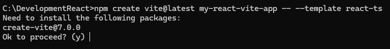
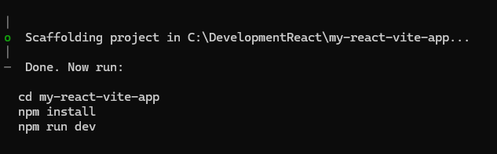
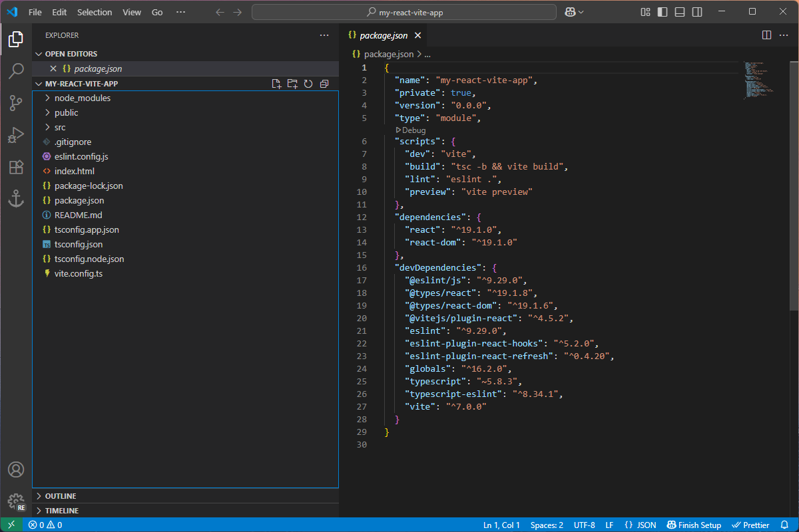

# Creating ReactJS (v19) Application with Vite

Vite requires Node.js version 20.19+, 22.12+

# Node

# NPM

# Create Application

```
https://vite.dev/guide/
```

### Creating the Application

```
npm create vite@latest my-react-vite-app -- --template react-ts
```







## Additional Components

### Fast Refresh via SWC (alternative to Babel)

To enable Fast Refresh using SWC, a high-performance JavaScript/TypeScript compiler written in Rust, install the official Vite React SWC plugin:

This replaces the default Babel-based plugin and offers significantly faster build and HMR times, especially in larger codebases.

```
npm install --save-dev @vitejs/plugin-react-swc
```

### Linting: React-Specific Best Practices

This plugin provides additional lint rules for React components and JSX beyond what's covered by base ESLint or eslint-plugin-react.

```
npm install --save-dev eslint-plugin-react-x
```

### To catch incorrect or risky use of React DOM APIs

This plugin helps identify and prevent misuse of React DOM methods and patterns, improving code safety and consistency.

```
npm install --save-dev eslint-plugin-react-dom
```

### to catch incorrect use of hooks

This plugin enforces the Rules of Hooks in React. It helps ensure correct usage of useEffect, useState, useCallback, etc.

```
npm install --save-dev eslint-plugin-react-hooks
```

.eslintrc:

```
{
  "plugins": ["react-hooks"],
  "rules": {
    "react-hooks/rules-of-hooks": "error",      // Checks rules of Hooks
    "react-hooks/exhaustive-deps": "warn"       // Checks effect dependencies
  }
}
```
